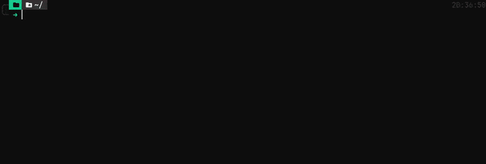

<p align="center">
  
</p>

<div align="center">

  <!-- <a href=""></a> -->
  <a href="https://github.com/massivebird/lantern/actions"></a>
  <a href="https://ratatui.rs/"></a>

</div>

# Lantern

Lantern is a website connectivity monitor written in Rust 🦀

Lantern offers a simple dashboard that lets you quickly check if your internet — or one of your favorite sites — is up or down.

## Building

To manually build the project, you must first [install Rust](https://www.rust-lang.org/tools/install).

Once you have Rust installed, run the following commands:

```bash
git clone https://github.com/massivebird/lantern
cd lantern
cargo run # runs unoptimized build
```

> `cargo run`'s build phase will tell you if you need to install other dependencies such as `pkg-config` and `libssl-dev`.

### Nix flake

If you're using Nix, you can add the following to your flake's `inputs`:

```nix
inputs = {
  # ...

  lantern = {
    url = "github:massivebird/lantern";
    inputs.nixpkgs.follows = "nixpkgs";
  };

  # ...
}
```

Then, add the following to your `environment.systemPackages`:

```nix
environment.systemPackages = [
  # ...
  inputs.lantern.packages.${pkgs.system}.default
  # ...
]
```

## Configuration

Lantern reads the config file at `$HOME/.config/lantern/config.toml`.

The schema looks something like this:

```toml
# $HOME/.config/lantern/config.toml

[[connection]]
name = "GitHub"
addr = "https://github.com"

[[connection]]
name = "PC"
addr = "192.168.1.159" # Local machine IP
```
